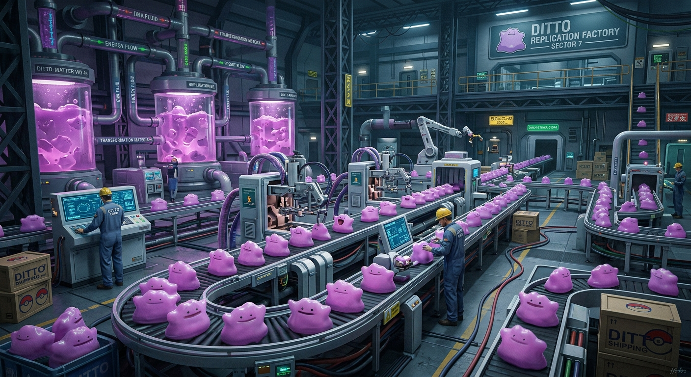
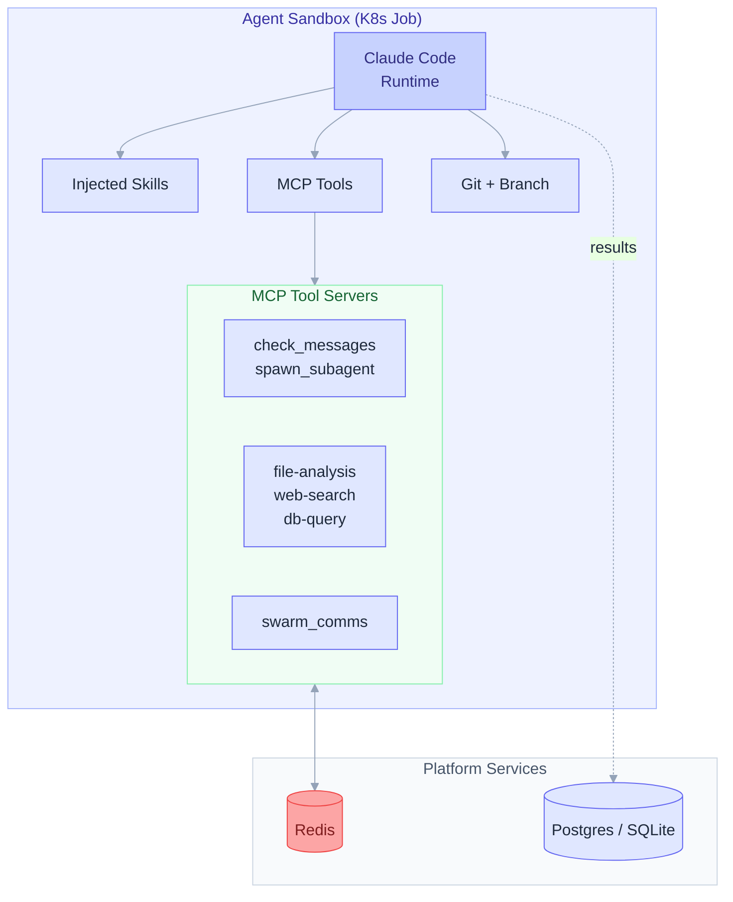
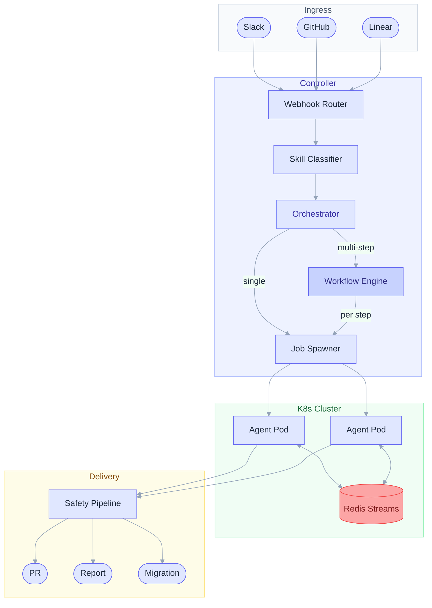
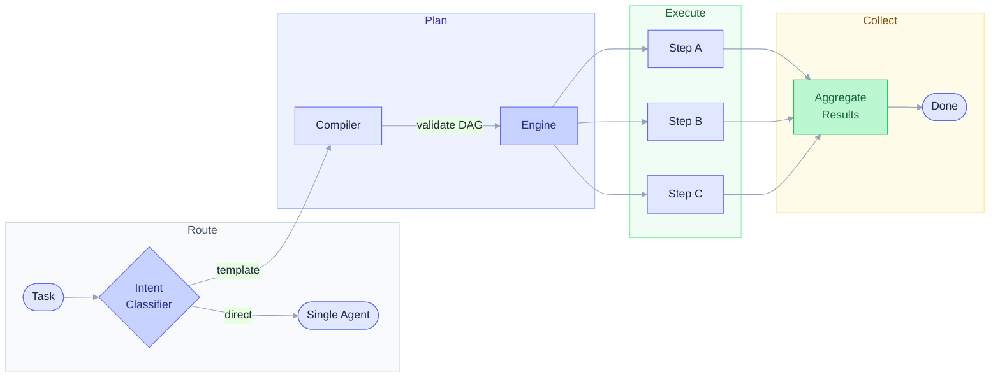
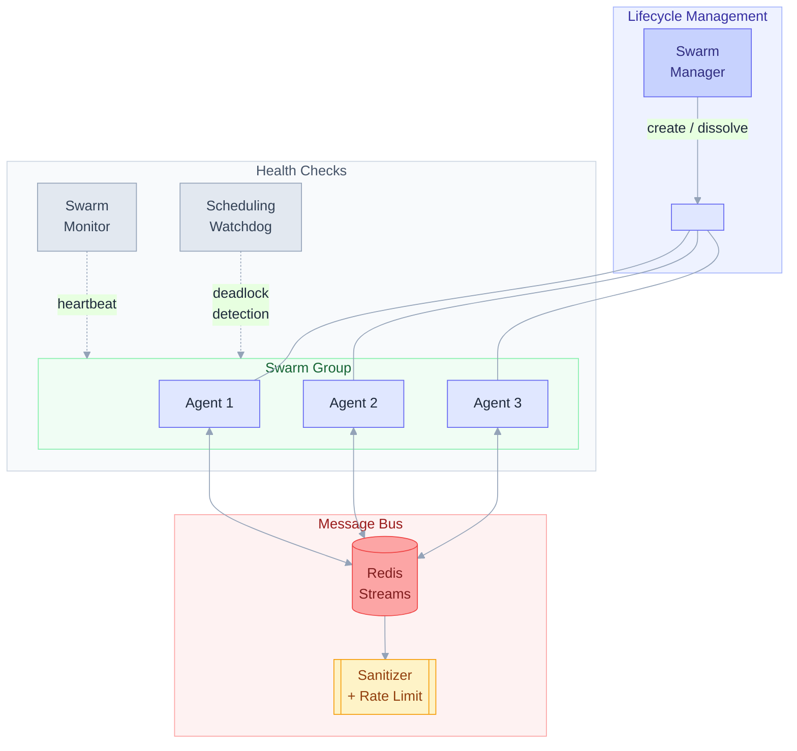
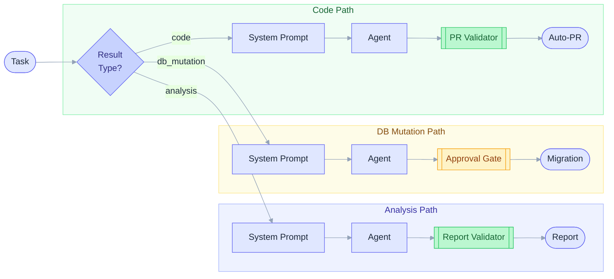

<div align="center">

# Ditto Factory



**Kubernetes-native agent platform for automating engineering workflows**

[](LICENSE)
[](https://python.org)
[](https://kubernetes.io)
[](https://docs.anthropic.com/en/docs/claude-code)

Code changes, research, data sourcing — each task runs as an auditable, sandboxed agent.
Define reusable workflows, let agents collaborate via swarm messaging, and get results back with full provenance.
Built on headless Claude Code, deployed anywhere K8s runs.

</div>

---

## Why Ditto Factory?

Every team building on AI agents hits the same walls: no auditability, no reuse, no safe way to let agents touch real systems. Ditto Factory is an open platform that solves this — define workflows once, run them safely at scale, and trace every result back to its source.

| Concern | Approach |
|:--|:--|
| **Agent Runtime** | Headless Claude Code (`claude -p`) |
| **Orchestration** | FastAPI controller + DAG workflow engine |
| **Sandboxes** | Ephemeral K8s Jobs (one per task) |
| **State** | PostgreSQL / SQLite + Redis |
| **Collaboration** | Swarm messaging via Redis Streams |
| **Deployment** | Helm chart (any K8s cluster) |
| **Paid Dependencies** | Anthropic API only |

---

## How It Works

```
Slack / GitHub / Linear / CLI
              │
              ▼
  ┌───────────────────────┐
  │   FastAPI Controller   │  ← Verify signatures, parse webhooks
  │                        │  ← Manage threads, conversations, locks
  │  ┌──────────────────┐ │
  │  │ Skill Classifier  │ │  ← Semantic search matches task → skills
  │  │ + Skill Registry  │ │  ← Versioned skills with embeddings (pgvector)
  │  └──────────────────┘ │
  └───────────┬───────────┘
              │
              ▼
  ┌───────────────────────┐       ┌──────────────────────┐
  │    K8s Job Spawner    │──────▶│     Agent Pod         │
  │  (selects agent type  │       │                      │
  │   from skill requires)│       │  1. Clone repo       │
  └───────────────────────┘       │  2. Inject skills    │  ← .claude/skills/*.md
                                  │  3. claude -p        │  ← Headless Claude Code
                                  │  4. Push branch      │
                                  │                      │
                                  │  MCP tools:          │
                                  │   ├ check_messages   │  ← Follow-ups from user
                                  │   ├ spawn_subagent   │  ← Parallel child agents
                                  │   └ gateway (SSE)    │  ← Remote tools (optional)
                                  └──────────┬───────────┘
                                             │
                                             ▼
                                  ┌──────────────────────┐
                                  │   Safety Pipeline     │  ← Auto-PR, anti-stall retry
                                  │   + Perf Tracker      │  ← Outcome → feedback loop
                                  │   → Report back       │  ← Post results to origin
                                  └──────────────────────┘
```

> **1. Receive** — Webhook arrives &nbsp;→&nbsp; **2. Classify** — Match task to skills &nbsp;→&nbsp; **3. Spawn** — K8s Job with injected skills &nbsp;→&nbsp; **4. Execute** — Claude Code runs with skills + MCP tools &nbsp;→&nbsp; **5. Report** — Auto-PR + post results to origin

**Extended pipeline (when workflows are enabled):**

When `DF_WORKFLOW_ENABLED=true`, incoming tasks can trigger multi-step workflows instead of single-agent runs:

1. **Intent classification** (optional) routes the task to a workflow template
2. **Compiler** expands the template into a DAG of concrete steps
3. **Engine** executes steps respecting dependencies, with CAS locking
4. **Swarm communication** (when `DF_SWARM_ENABLED=true`) lets agents in parallel branches exchange messages via Redis Streams
5. **Crash recovery** reconciles incomplete executions on restart

---

## Quick Start

### Local Development (Docker Compose)

```bash
git clone https://github.com/tedahn/ditto-factory.git
cd ditto-factory
docker compose up -d

# Verify
curl http://localhost:8000/health
# → {"status":"ok"}
```

Starts the controller with SQLite (no Postgres needed) and Redis.

### Kubernetes (Helm)

```bash
helm install ditto-factory ./charts/ditto-factory \
  --set secrets.anthropicApiKey=$ANTHROPIC_API_KEY \
  --set secrets.slackSigningSecret=$SLACK_SIGNING_SECRET \
  --set secrets.slackBotToken=$SLACK_BOT_TOKEN
```

Includes PostgreSQL, Redis (Bitnami subcharts), RBAC, network policies, and optional ingress.

### Running Tests

```bash
cd controller
uv pip install -e ".[dev]"
uv run pytest tests/ -v          # 134+ tests, ~2 seconds

# K8s live tests (requires running cluster + Redis)
AAL_K8S_LIVE_TEST=1 uv run pytest tests/e2e/test_k8s_live.py -v
```

---

## Agent Runtime

Each agent runs inside an ephemeral K8s Job with a controlled set of capabilities. The controller assembles the runtime environment before launch.



| Capability | How It Works |
|:--|:--|
| **Skill hotloading** | Controller selects skills via semantic search, injects them into the workspace as `.claude/skills/*.md` before launch. Character budget enforced (16K default). |
| **MCP tools** | Three tool servers available inside the sandbox: message queue (follow-ups + subagent spawning), gateway (file analysis, web search, DB queries via SSE), and swarm comms (inter-agent messaging). |
| **Resource profiles** | Per-role CPU/memory requests and limits. Swarm agents get role-specific profiles (e.g., research agents get more memory than coordinator agents). |
| **Tracing** | Structured trace spans with store, renderer, and API. Each task produces queryable traces with agent ID, timestamps, and step metadata. |
| **Sandbox isolation** | Non-root (UID 1000), all capabilities dropped, no privilege escalation. API keys injected via K8s Secrets, never in environment. Network egress restricted to DNS, HTTPS, and Redis. |
| **Subagents** | Agents can spawn child K8s Jobs for parallel subtasks via the `spawn_subagent` MCP tool. Parent polls for results via Redis. |

---

## Architecture



<details>
<summary><strong>Project Structure</strong></summary>

```
controller/src/controller/
├── main.py                  # FastAPI app, lifespan, webhook routing
├── config.py                # Pydantic Settings (DF_ env prefix)
├── models.py                # TaskRequest, AgentResult, Thread, Job
├── orchestrator.py          # Core lifecycle: receive → spawn → complete
├── gateway.py               # MCP Gateway scope management
├── subagent.py              # Subagent spawn handler (Redis pubsub)
├── state/
│   ├── protocol.py          # StateBackend protocol (swappable)
│   ├── postgres.py          # Production backend (asyncpg)
│   ├── sqlite.py            # Local dev backend (aiosqlite)
│   └── redis_state.py       # Ephemeral state (task handoff, queues)
├── integrations/
│   ├── protocol.py          # Integration protocol
│   ├── registry.py          # Dynamic webhook router
│   ├── slack.py             # Slack: signatures, bot filtering, threading
│   ├── github.py            # GitHub: 4 event types, org allowlist, auto-PR
│   ├── linear.py            # Linear: GraphQL, team-to-repo mapping
│   ├── thread_id.py         # Deterministic SHA256 thread IDs
│   └── sanitize.py          # Untrusted content wrapping
├── skills/
│   ├── api.py               # REST API (CRUD, search, metrics, agent types)
│   ├── registry.py          # Skill CRUD + tag/embedding search
│   ├── classifier.py        # Task → skill matching (semantic + tag fallback)
│   ├── injector.py          # Format skills for Redis payload injection
│   ├── resolver.py          # Skill requirements → Docker image selection
│   ├── tracker.py           # Performance tracking + feedback loop
│   ├── embedding.py         # Voyage-3 / NoOp embedding providers
│   ├── embedding_cache.py   # LRU cache for task embeddings
│   └── models.py            # Skill, SkillVersion, AgentType, etc.
├── jobs/
│   ├── spawner.py           # K8s Job creation with security context
│   ├── monitor.py           # Redis result polling + K8s status
│   ├── safety.py            # Post-run: PR check, anti-stall, queue drain
│   └── validators.py        # ResultValidator protocol (PR + Report validators)
├── swarm/
│   ├── redis_streams.py     # Redis Streams wrapper for agent messaging
│   ├── sanitizer.py         # Layered allowlist sanitizer for messages
│   ├── async_spawner.py     # Parallel K8s Job creation (asyncio.gather)
│   ├── manager.py           # Swarm lifecycle (create, join, leave, dissolve)
│   ├── monitor.py           # Heartbeat detection and stale-agent cleanup
│   └── watchdog.py          # Scheduling deadlock prevention
├── workflows/
│   ├── models.py            # WorkflowTemplate, Execution, Step, StepResult
│   ├── compiler.py          # DAG validation + fan-out expansion
│   ├── templates.py         # Template CRUD with versioning + rollback
│   ├── engine.py            # CAS-locking executor with crash recovery
│   └── api.py               # REST endpoints (templates, executions, steps)
└── prompt/
    └── builder.py           # System prompt with CLAUDE.md + history

src/mcp/
├── message_queue/
│   └── server.js            # MCP: check_messages + spawn_subagent
└── gateway/
    ├── server.js             # MCP Gateway (Express + SSE transport)
    └── tools/
        ├── file-analysis.js  # Sandboxed file structure analysis
        ├── web-search.js     # Brave Search API client
        ├── db-query.js       # Read-only PostgreSQL queries
        └── index.js          # Tool registry
```

</details>

### Key Design Decisions

- **Claude Code as runtime** — No custom agent loop. Claude Code handles file editing, context management, tool selection, error recovery, and git operations natively.
- **Ephemeral K8s Jobs** — Each task gets a fresh container. No persistent sandboxes, no state leakage. Jobs auto-clean via `ttlSecondsAfterFinished`.
- **Protocol-based backends** — `StateBackend` and `Integration` are Python protocols. Swap Postgres for SQLite, or add a new integration by implementing 4 methods.
- **Skill hotloading** — Controller-side semantic search selects per-task skills from a registry and injects them into the agent workspace before launch. Avoids Claude Code's ~42 skill metadata cap.
- **Three-layer capability model** — Agent Types (Docker images) for coarse capabilities, Skills (injected per-task) for fine-grained instructions, Subagents (child K8s Jobs) for parallel subtasks.
- **MCP Gateway** — Centralized MCP server with per-session tool scoping. Agents connect via SSE, reducing the need for specialized Docker images.
- **Redis for ephemeral state** — Task handoff, result retrieval, message queuing, and gateway scopes use Redis with TTLs. Durable state lives in Postgres/SQLite.
- **Advisory locks** — Prevent duplicate job spawns. Postgres uses `pg_try_advisory_lock`, SQLite uses a locks table.

---

## Workflow Engine

> Requires `DF_WORKFLOW_ENABLED=true`

The workflow engine orchestrates multi-step agent pipelines using DAG-based templates.



**Key concepts:**
- **Templates** — Versioned YAML definitions with steps, dependencies, and fan-out patterns. CRUD via REST API with rollback support.
- **Compiler** — Validates DAG structure (no cycles), expands fan-out steps, and produces an execution plan.
- **Engine** — Executes steps with CAS (Compare-And-Swap) locking to prevent duplicate work. Supports parallel branches and sequential chains.
- **Crash Recovery** — On startup, the engine reconciles incomplete executions and resumes from the last successful step.

**API endpoints** (mounted at `/api/v1/workflows`):

| Method | Path | Description |
|:--|:--|:--|
| `POST` | `/templates` | Create template |
| `GET` | `/templates` | List templates |
| `GET` | `/templates/{slug}` | Get template |
| `PUT` | `/templates/{slug}` | Update template |
| `DELETE` | `/templates/{slug}` | Delete template |
| `POST` | `/templates/{slug}/rollback` | Rollback to previous version |
| `POST` | `/executions` | Start execution |
| `GET` | `/executions` | List executions |

---

## Swarm Communication

> Requires `DF_SWARM_ENABLED=true`

Agents within a workflow can communicate in real time via Redis Streams, enabling collaborative problem-solving.



**Components:**
- **SwarmManager** — Creates and manages agent groups with lifecycle hooks (join, leave, dissolve).
- **SwarmMonitor** — Detects stale agents via heartbeat checks and triggers cleanup.
- **SchedulingWatchdog** — Prevents deadlocks when K8s cannot schedule agent pods within the grace period.
- **AsyncJobSpawner** — Launches multiple K8s Jobs in parallel with per-role resource profiles (CPU/memory requests and limits).
- **Message Sanitizer** — Layered allowlist filter that strips unsafe content from inter-agent messages.

**Security:** All messages pass through the allowlist sanitizer before delivery. Rate limiting is enforced per-group (messages/min, broadcasts/min, bytes/min).

---

## Generalized Task Types

Beyond code changes, Ditto Factory supports multiple result types with specialized handling:



| Task Type | Result Type | Safety Pipeline | Example |
|:--|:--|:--|:--|
| Code (default) | PR | PR review + anti-stall | "Fix the login bug" |
| Analysis | Report | Format validation | "Audit our API latency" |
| DB Mutation | Migration | Approval gate | "Add an index on users.email" |

Each task type gets:
- **Type-aware system prompts** — The agent receives instructions tailored to its result type.
- **Result validators** — PR results are checked for commits; reports are checked for structure.
- **Type-aware formatting** — Results are formatted appropriately before delivery to integrations.

Enable non-default types via `DF_ANALYSIS_ENABLED`, `DF_DB_MUTATION_ENABLED`. DB mutations require `DF_REQUIRE_APPROVAL_FOR_MUTATIONS=true` (default).

---

## Configuration

All settings use the `DF_` environment variable prefix.

<details>
<summary><strong>Environment Variables</strong></summary>

| Variable | Default | Description |
|:--|:--|:--|
| `DF_ANTHROPIC_API_KEY` | *(required)* | Anthropic API key |
| `DF_REDIS_URL` | `redis://localhost:6379` | Redis connection |
| `DF_DATABASE_URL` | `postgresql://localhost:5432/aal` | Postgres or `sqlite:///path` |
| `DF_AGENT_IMAGE` | `ditto-factory-agent:latest` | Agent container image |
| `DF_MAX_JOB_DURATION_SECONDS` | `1800` | K8s Job timeout |
| `DF_AUTO_OPEN_PR` | `true` | Auto-create PRs on commits |
| `DF_RETRY_ON_EMPTY_RESULT` | `true` | Retry if agent produces no changes |
| `DF_SLACK_ENABLED` | `false` | Enable Slack integration |
| `DF_GITHUB_ENABLED` | `false` | Enable GitHub integration |
| `DF_LINEAR_ENABLED` | `false` | Enable Linear integration |
| `DF_SKILL_REGISTRY_ENABLED` | `false` | Enable skill hotloading |
| `DF_SKILL_EMBEDDING_PROVIDER` | `none` | Embedding provider (`none` or `voyage`) |
| `DF_VOYAGE_API_KEY` | | Voyage-3 API key for semantic search |
| `DF_GATEWAY_ENABLED` | `false` | Enable MCP Gateway |
| `DF_GATEWAY_URL` | | Gateway service URL |
| `DF_SUBAGENT_ENABLED` | `false` | Enable subagent spawning |
| `DF_WORKFLOW_ENABLED` | `false` | Enable workflow engine |
| `DF_MAX_AGENTS_PER_EXECUTION` | `20` | Max agents per workflow run |
| `DF_MAX_CONCURRENT_AGENTS` | `50` | Global agent concurrency limit |
| `DF_WORKFLOW_STEP_TIMEOUT_SECONDS` | `1800` | Per-step timeout |
| `DF_SWARM_ENABLED` | `false` | Enable swarm communication |
| `DF_SWARM_MAX_AGENTS_PER_GROUP` | `10` | Max agents per swarm group |
| `DF_SWARM_HEARTBEAT_INTERVAL_SECONDS` | `30` | Agent heartbeat interval |
| `DF_SWARM_HEARTBEAT_TIMEOUT_SECONDS` | `90` | Stale agent threshold |
| `DF_ANALYSIS_ENABLED` | `false` | Enable analysis task type |
| `DF_DB_MUTATION_ENABLED` | `false` | Enable DB mutation task type |
| `DF_FILE_OUTPUT_ENABLED` | `false` | Enable file-output task type |
| `DF_API_ACTION_ENABLED` | `false` | Enable API-action task type |
| `DF_REQUIRE_APPROVAL_FOR_MUTATIONS` | `true` | Gate DB mutations behind approval |
| `DF_INTENT_CLASSIFIER_ENABLED` | `false` | Auto-route tasks to workflow templates |
| `DF_INTENT_CONFIDENCE_THRESHOLD` | `0.7` | Min confidence for intent routing |

See [`controller/src/controller/config.py`](controller/src/controller/config.py) for the full list.

</details>

---

## Integrations

<table>
<tr>
<td width="33%" valign="top">

### Slack
- Mention the bot or message in a thread
- Follow-ups queue while agent runs, delivered via MCP
- Results posted as thread replies with PR links

</td>
<td width="33%" valign="top">

### GitHub
- Issue comments, new issues, PR reviews
- Org allowlist for security
- Auto-PR creation on commits

</td>
<td width="33%" valign="top">

### Linear
- Comment on an issue to trigger agent
- Team-to-repo mapping for auto resolution
- Results posted as comments via GraphQL

</td>
</tr>
</table>

---

## Roadmap

- **Observability & provenance** — Trace every result back to source, agent, and timestamp
- **User-facing transparency** — View workflow steps, status, and tool usage from the API
- **Intent classification** — Auto-route natural language requests to workflow templates
- **Development platform** — Tools for building, testing, and versioning skills and workflows

---

## Security

| Layer | Protection |
|:--|:--|
| **Container isolation** | Non-root (UID 1000), drop all capabilities, no privilege escalation |
| **Network policies** | Agent egress restricted to DNS, HTTPS (GitHub), and Redis only |
| **Webhook verification** | HMAC-SHA256 signature validation for all integrations |
| **Prompt safety** | Untrusted content wrapped in XML tags to prevent injection |
| **Concurrency** | Advisory locks prevent race conditions on duplicate webhooks |

---

<div align="center">

**[MIT License](LICENSE)**

</div>
