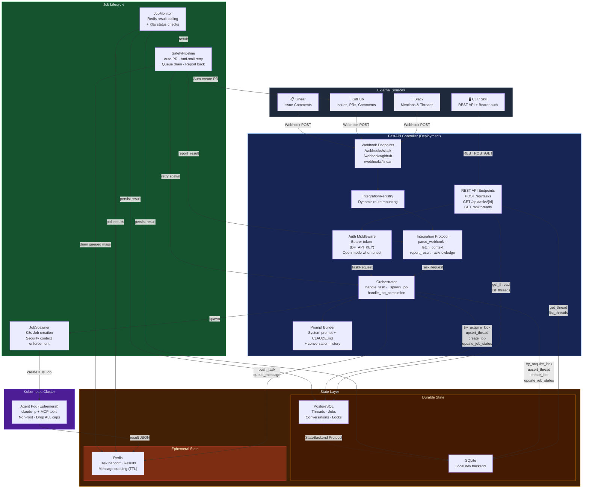
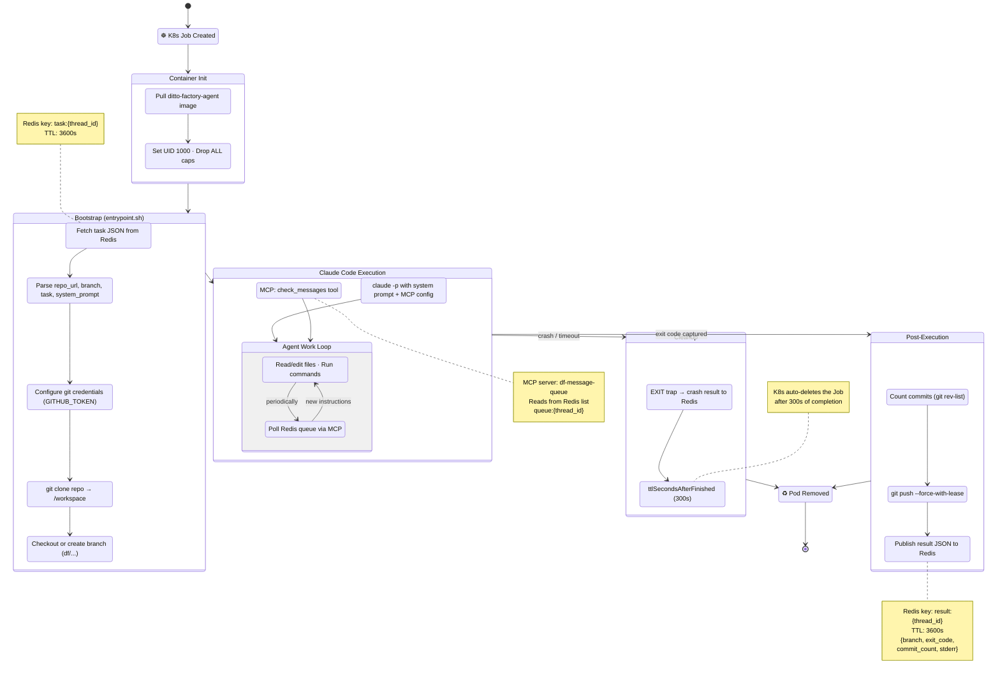
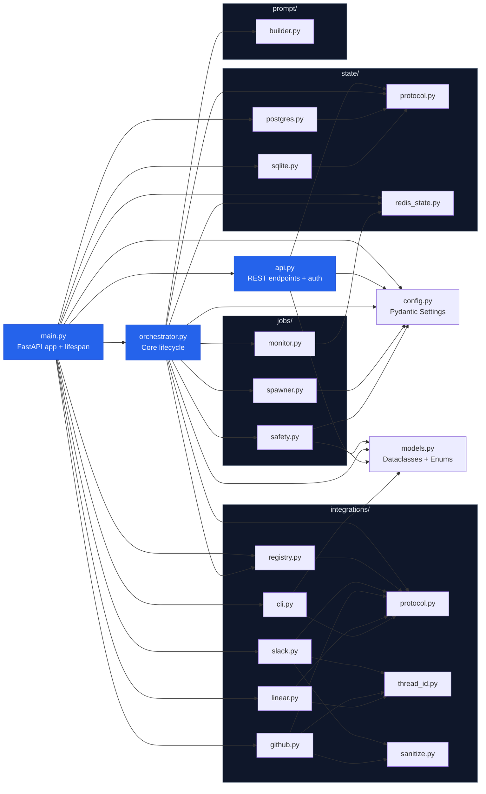
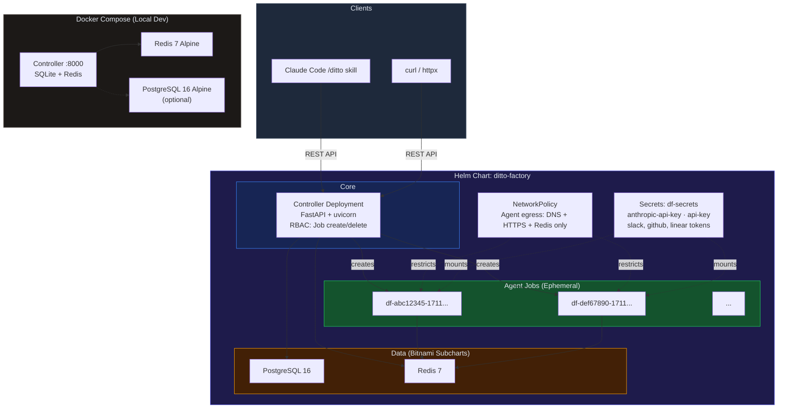

# Ditto Factory Architecture

## System Overview

```mermaid
graph TB
    subgraph External["External Sources"]
        Slack["🔔 Slack<br/>Mentions & Threads"]
        GitHub["🐙 GitHub<br/>Issues, PRs, Comments"]
        Linear["📋 Linear<br/>Issue Comments"]
        CLI["🖥️ CLI / Skill<br/>REST API + Bearer auth"]
    end

    subgraph Controller["FastAPI Controller (Deployment)"]
        direction TB
        Webhooks["Webhook Endpoints<br/>/webhooks/slack<br/>/webhooks/github<br/>/webhooks/linear"]
        APIEndpoints["REST API Endpoints<br/>POST /api/tasks<br/>GET /api/tasks/{id}<br/>GET /api/threads"]
        AuthMiddleware["Auth Middleware<br/>Bearer token (DF_API_KEY)<br/>Open mode when unset"]
        Registry["IntegrationRegistry<br/>Dynamic route mounting"]
        Integrations["Integration Protocol<br/>parse_webhook · fetch_context<br/>report_result · acknowledge"]
        Orchestrator["Orchestrator<br/>handle_task · _spawn_job<br/>handle_job_completion"]
        PromptBuilder["Prompt Builder<br/>System prompt + CLAUDE.md<br/>+ conversation history"]
    end

    subgraph Jobs["Job Lifecycle"]
        Spawner["JobSpawner<br/>K8s Job creation<br/>Security context enforcement"]
        Monitor["JobMonitor<br/>Redis result polling<br/>+ K8s status checks"]
        Safety["SafetyPipeline<br/>Auto-PR · Anti-stall retry<br/>Queue drain · Report back"]
    end

    subgraph K8s["Kubernetes Cluster"]
        AgentPod["Agent Pod (Ephemeral)<br/>claude -p + MCP tools<br/>Non-root · Drop ALL caps"]
    end

    subgraph State["State Layer"]
        direction LR
        subgraph Durable["Durable State"]
            Postgres["PostgreSQL<br/>Threads · Jobs<br/>Conversations · Locks"]
            SQLite["SQLite<br/>Local dev backend"]
        end
        subgraph Ephemeral["Ephemeral State"]
            Redis["Redis<br/>Task handoff · Results<br/>Message queuing (TTL)"]
        end
    end

    %% Webhook path
    Slack -->|Webhook POST| Webhooks
    GitHub -->|Webhook POST| Webhooks
    Linear -->|Webhook POST| Webhooks

    Webhooks --> Registry
    Registry --> Integrations
    Integrations -->|TaskRequest| Orchestrator

    %% REST API path (bypasses webhook parsing)
    CLI -->|"REST POST/GET"| APIEndpoints
    APIEndpoints --> AuthMiddleware
    AuthMiddleware -->|TaskRequest| Orchestrator
    APIEndpoints -->|"get_thread<br/>list_threads"| Postgres
    APIEndpoints -->|"get_thread<br/>list_threads"| SQLite

    Orchestrator --> PromptBuilder
    Orchestrator -->|"try_acquire_lock<br/>upsert_thread<br/>create_job<br/>update_job_status"| Postgres
    Orchestrator -->|"try_acquire_lock<br/>upsert_thread<br/>create_job<br/>update_job_status"| SQLite
    Orchestrator -->|"push_task<br/>queue_message"| Redis
    Orchestrator -->|spawn| Spawner

    Spawner -->|"create K8s Job"| AgentPod
    AgentPod -->|"result JSON"| Redis
    Monitor -->|"poll results"| Redis
    Monitor -->|"persist result"| Postgres
    Monitor -->|"persist result"| SQLite
    Monitor -->|result| Safety

    Safety -->|"Auto-create PR"| GitHub
    Safety -->|report_result| Integrations
    Safety -->|"retry spawn"| Orchestrator
    Safety -->|"drain queued msgs"| Redis

    Postgres -.-|"StateBackend Protocol"| SQLite

    style External fill:#1e293b,stroke:#475569,color:#e2e8f0
    style Controller fill:#172554,stroke:#3b82f6,color:#e2e8f0
    style Jobs fill:#14532d,stroke:#22c55e,color:#e2e8f0
    style K8s fill:#4c1d95,stroke:#8b5cf6,color:#e2e8f0
    style State fill:#422006,stroke:#f59e0b,color:#e2e8f0
    style Durable fill:#451a03,stroke:#d97706,color:#fef3c7
    style Ephemeral fill:#7c2d12,stroke:#ef4444,color:#fef3c7
```

## Ephemeral Agent Lifecycle

```mermaid
stateDiagram-v2
    direction TB

    state "☸️ K8s Job Created" as Created
    state "Container Init" as Init {
        state "Pull ditto-factory-agent image" as Pull
        state "Set UID 1000 · Drop ALL caps" as Security
        Pull --> Security
    }

    state "Bootstrap (entrypoint.sh)" as Bootstrap {
        state "Fetch task JSON from Redis" as FetchTask
        state "Parse repo_url, branch, task, system_prompt" as Parse
        state "Configure git credentials (GITHUB_TOKEN)" as GitCreds
        state "git clone repo → /workspace" as Clone
        state "Checkout or create branch (df/...)" as Branch
        FetchTask --> Parse
        Parse --> GitCreds
        GitCreds --> Clone
        Clone --> Branch
    }

    state "Claude Code Execution" as Execution {
        state "claude -p with system prompt + MCP config" as Claude
        state "MCP: check_messages tool" as MCP

        state "Agent Work Loop" as Work {
            state "Read/edit files · Run commands" as Edit
            state "Poll Redis queue via MCP" as Poll
            Edit --> Poll: periodically
            Poll --> Edit: new instructions
        }

        Claude --> Work
        MCP --> Work
    }

    state "Post-Execution" as PostExec {
        state "Count commits (git rev-list)" as Count
        state "git push --force-with-lease" as Push
        state "Publish result JSON to Redis" as Publish
        Count --> Push
        Push --> Publish
    }

    state "Cleanup" as Cleanup {
        state "EXIT trap → crash result to Redis" as Trap
        state "ttlSecondsAfterFinished (300s)" as TTL
        Trap --> TTL
    }

    state "♻️ Pod Removed" as Removed

    [*] --> Created
    Created --> Init
    Init --> Bootstrap
    Bootstrap --> Execution
    Execution --> PostExec: exit code captured
    Execution --> Cleanup: crash / timeout
    PostExec --> Removed
    Cleanup --> Removed
    Removed --> [*]

    note left of FetchTask
        Redis key: task:{thread_id}
        TTL: 3600s
    end note

    note right of MCP
        MCP server: df-message-queue
        Reads from Redis list
        queue:{thread_id}
    end note

    note right of Publish
        Redis key: result:{thread_id}
        TTL: 3600s
        {branch, exit_code,
         commit_count, stderr}
    end note

    note left of TTL
        K8s auto-deletes the Job
        after 300s of completion
    end note
```

## Module Dependency Graph

```mermaid
graph LR
    main["main.py<br/>FastAPI app + lifespan"]
    config["config.py<br/>Pydantic Settings"]
    models["models.py<br/>Dataclasses + Enums"]
    orch["orchestrator.py<br/>Core lifecycle"]
    api["api.py<br/>REST endpoints + auth"]

    subgraph integrations["integrations/"]
        i_proto["protocol.py"]
        i_reg["registry.py"]
        i_slack["slack.py"]
        i_github["github.py"]
        i_linear["linear.py"]
        i_cli["cli.py"]
        i_thread["thread_id.py"]
        i_sanitize["sanitize.py"]
    end

    subgraph state["state/"]
        s_proto["protocol.py"]
        s_pg["postgres.py"]
        s_sq["sqlite.py"]
        s_redis["redis_state.py"]
    end

    subgraph jobs["jobs/"]
        j_spawn["spawner.py"]
        j_mon["monitor.py"]
        j_safe["safety.py"]
    end

    subgraph prompt["prompt/"]
        p_build["builder.py"]
    end

    main --> config
    main --> api
    main --> orch
    main --> i_reg
    main --> i_slack
    main --> i_github
    main --> i_linear
    main --> i_cli
    main --> s_pg
    main --> s_sq
    main --> s_redis

    api --> config
    api --> models
    api --> s_proto

    orch --> config
    orch --> models
    orch --> s_proto
    orch --> s_redis
    orch --> i_proto
    orch --> i_reg
    orch --> j_spawn
    orch --> j_mon
    orch --> j_safe
    orch --> p_build

    i_reg --> i_proto
    i_slack --> i_proto
    i_github --> i_proto
    i_linear --> i_proto
    i_cli --> i_proto
    i_cli --> models
    i_slack --> i_thread
    i_github --> i_thread
    i_linear --> i_thread
    i_slack --> i_sanitize
    i_github --> i_sanitize

    s_pg --> s_proto
    s_sq --> s_proto

    j_spawn --> config
    j_safe --> config
    j_safe --> models
    j_mon --> s_redis

    style main fill:#2563eb,stroke:#1d4ed8,color:#fff
    style orch fill:#2563eb,stroke:#1d4ed8,color:#fff
    style api fill:#2563eb,stroke:#1d4ed8,color:#fff
    style integrations fill:#0f172a,stroke:#475569,color:#e2e8f0
    style state fill:#0f172a,stroke:#475569,color:#e2e8f0
    style jobs fill:#0f172a,stroke:#475569,color:#e2e8f0
    style prompt fill:#0f172a,stroke:#475569,color:#e2e8f0
```

## Infrastructure (Deployment View)

```mermaid
graph TB
    subgraph Helm["Helm Chart: ditto-factory"]
        subgraph Core["Core"]
            Ctrl["Controller Deployment<br/>FastAPI + uvicorn<br/>RBAC: Job create/delete"]
        end
        subgraph Data["Data (Bitnami Subcharts)"]
            PG["PostgreSQL 16"]
            RD["Redis 7"]
        end
        subgraph Agents["Agent Jobs (Ephemeral)"]
            A1["df-abc12345-1711..."]
            A2["df-def67890-1711..."]
            An["..."]
        end
        NP["NetworkPolicy<br/>Agent egress: DNS + HTTPS + Redis only"]
        Sec["Secrets: df-secrets<br/>anthropic-api-key · api-key<br/>slack, github, linear tokens"]
    end

    subgraph Clients["Clients"]
        Skill["Claude Code /ditto skill"]
        Curl["curl / httpx"]
    end

    subgraph Docker["Docker Compose (Local Dev)"]
        DC_Ctrl["Controller :8000<br/>SQLite + Redis"]
        DC_Redis["Redis 7 Alpine"]
        DC_PG["PostgreSQL 16 Alpine<br/>(optional)"]
    end

    Skill -->|"REST API"| Ctrl
    Curl -->|"REST API"| Ctrl
    Ctrl --> PG
    Ctrl --> RD
    Ctrl -->|"creates"| A1
    Ctrl -->|"creates"| A2
    A1 --> RD
    A2 --> RD
    NP -.->|"restricts"| A1
    NP -.->|"restricts"| A2
    Sec -.->|"mounts"| A1
    Sec -.->|"mounts"| A2

    DC_Ctrl --> DC_Redis
    DC_Ctrl -.-> DC_PG

    style Helm fill:#1e1b4b,stroke:#6366f1,color:#e2e8f0
    style Core fill:#172554,stroke:#3b82f6,color:#e2e8f0
    style Data fill:#422006,stroke:#f59e0b,color:#e2e8f0
    style Agents fill:#14532d,stroke:#22c55e,color:#e2e8f0
    style Clients fill:#1e293b,stroke:#475569,color:#e2e8f0
    style Docker fill:#1c1917,stroke:#78716c,color:#e2e8f0
```
